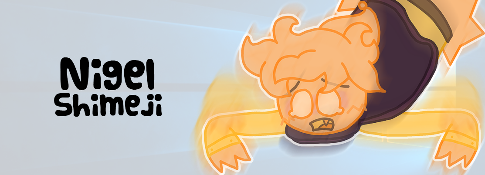

# Nigel Shimeji

A strange little guy that lives on your desktop. He hovers, stares, and will most likely make your day worse.

Heavily customized fork of [Shimeji-ee](https://github.com/DalekCraft2/Shimeji-Desktop) (Kilkakon/Shimeji-ee → Yuki Yamada's original Shimeji) focused on a single character — **Nigel**.

## Requirements

* Windows Vista+ / macOS / Linux X11
* Java 25+
* Maven 3 (bundled via IntelliJ) for building

## Quick start

1. Download `target/Shimeji-ee_*.zip` from Releases or build below.
2. Unzip, run `Shimeji-ee.jar` (or `Shimeji-ee.exe` on Windows).
3. Right-click tray icon → general options; right-click Nigel → mascot options; `Call Shimeji` spawns more.

## Building

```bash
# IntelliJ: open folder → Maven tool window (m) → Shimeji-ee → Run Maven build
# CLI:
mvn package
# outputs target/Shimeji-ee.jar, target/Shimeji-ee.exe, target/Shimeji-ee_*.zip
```

The fork is Maven-based (migrated from Ant), `launch4j` for exe, proper DPI `scaling`.

## Project structure

```
img/NigelShimeji/          # only tracked image set (192x192, anchor 96,200)
  conf/actions.xml         # Stand/Walk/LeapForMouse/Grasp/Fall etc.
  conf/behaviors.xml       # floor Condition → StandUp/Walk/ChaseMouse/CatchMouse Frequencies
  *.png                    # stand, walk, lunge, struggle, cuddle, drag, fall...
conf/Mascot.xsd            # synced to img/NigelShimeji/conf/Mascot.xsd
src/main/java/com/group_finity/mascot/action/
  GraspMouse.java          # cursor grab + cuddle/tackle/struggle
  CursorLeap.java          # frozen-target leap
  Mascot.java              # isGrasping, approachClosingSpeed, window cursor guard
src/main/resources/schema.properties
```

## Configuration

Nigel works out of the box — no config needed. Right-click him for mascot options (`Chase and Hug/Eat`, `Telekinesis Window/Mouse/Nigel`, `CatchMouse` force).

To tweak his behavior (frequencies, grasp, telekinesis, custom image sets), see **[CONFIGURATION.md](CONFIGURATION.md)**.

## Troubleshooting

* Takes long to start / no mascot: move extra sets to `img/unused/`, check `ShimejieeLog*.log`, run `java -jar Shimeji-ee.jar` for stacktrace. Tray icon but no mascot → wrong folder contents or Java version.
* `BUILD FAILURE release version 25 not supported` + `Unsupported major.minor version 69.0` with `mvn` is IntelliJ's bundled Maven Guice on JDK25 warning — not a source error; direct `javac` or `mvn -DskipTests` with proper JDK still produces `target/Shimeji-ee.jar`.
* Cursor flicker during grasp is `Mascot.mouseMoved/mouseDragged` early-return + per-tick `reassertCursorHidden()` — intended.

## Credits / Licensing

* Original Shimeji — Yuki Yamada (Group Finity) — zlib/libpng
* Shimeji-ee — Kilkakon + community — New BSD
* Linux/macOS ports — asdfman/linux-shimeji, nonowarn/shimeji4mac, LavenderSnek/ShimejiEE-cross-platform
* This fork — JDK 25 migration, Maven, DPI scaling, `GraspMouse`/`CursorLeap`/cuddle gameplay — same New BSD

Fork base: https://github.com/DalekCraft2/Shimeji-Desktop — original README archived as `originalreadme.txt`.
